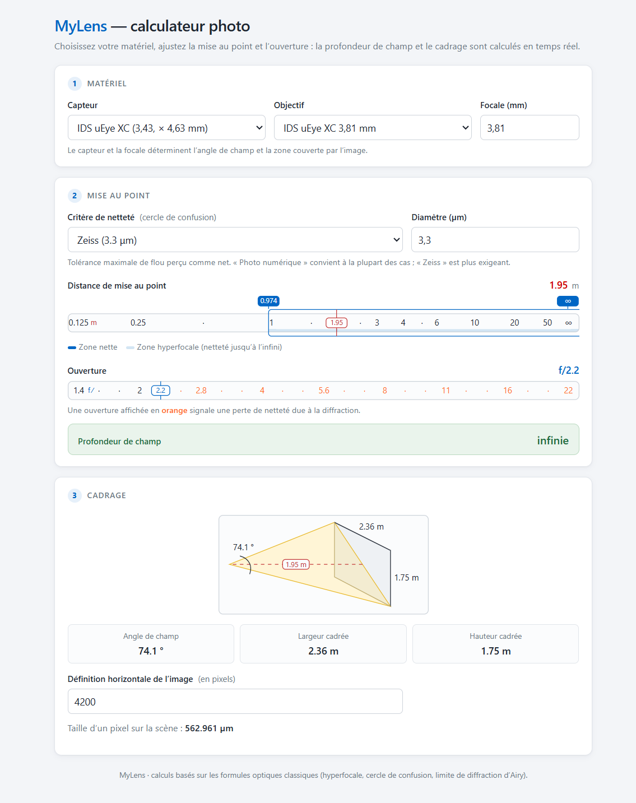

# MyLens

Calculateur photo dans le navigateur. À partir d’un capteur, d’un objectif, d’une distance de mise au point et d’une ouverture, MyLens affiche en temps réel la profondeur de champ, l’angle de champ, la largeur et la hauteur cadrées, ainsi que la taille d’un pixel sur la scène.

> **Limitations** : MyLens est une page HTML autonome (pas de serveur, pas d’installation). Les calculs reposent sur les formules optiques classiques (hyperfocale, cercle de confusion, limite de diffraction d’Airy) et restent des approximations valides pour un objectif mince idéal.

## Installation

MyLens ne nécessite aucune installation : il s’agit d’un unique fichier `lens.html`.

Téléchargez le fichier [`lens.html`](lens.html?inline=false), puis ouvrez-le dans votre navigateur (Chrome, Firefox, Edge, Safari…).

## Utilisation

L’interface est organisée en trois panneaux :

1. **Matériel** — choisissez le capteur (du capteur industriel au moyen format), l’objectif parmi les préréglages ou saisissez une focale personnalisée.
2. **Mise au point** — sélectionnez le critère de netteté (cercle de confusion « Photo numérique », « Zeiss » ou personnalisé), puis ajustez la distance de mise au point et l’ouverture à l’aide des curseurs. La profondeur de champ est affichée sous les curseurs ; les valeurs d’ouverture passent en orange lorsque la diffraction dégrade la netteté.
3. **Cadrage** — un schéma illustre l’angle de champ, la largeur et la hauteur cadrées à la distance de mise au point. En renseignant la définition horizontale de l’image (en pixels), MyLens calcule la taille d’un pixel projeté sur la scène.

Les réglages sont conservés localement dans le navigateur (`localStorage`) et restaurés à la prochaine ouverture.
